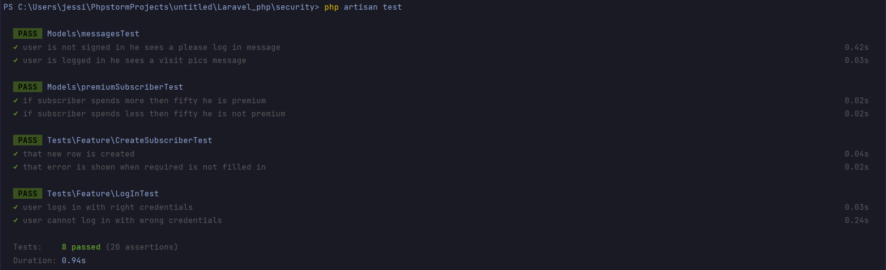
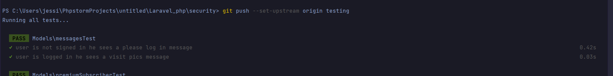

# Testing

> #### As a user I want to be able to delete a subscriber from the table so that my table can stay relevant.  

Happy path 
Given: A user wants to create a subscriber in the table, 
When: user fills in every required field, 
Then: new row will be created 

### Feature test plan for happy path
> 1. Create a new user via user factory
> 2. Act as the created user
> 3. Send a post request to the 'subscribers.store' route with required fields except for the money spent
> 4. Check if the response status is 302
> 5. Check if the session has no errors
> 6. Check if the subscriber was created in the database based on count and name of the subscriber 
#### Overall this plan can test whether a user can create new subscribes in the database while passing all the required values
  
Unhappy path 
Given: A user want to create a subscriber in the table, 
When: user doesn't fill in every required field, 
Then: an error message will be displayed

### Feature test plan for unhappy
> 1. Create a new user via user factory
> 2. Act as the created user
> 3. Send a post request to the 'subscribers.store' route with required fields
> 4. Check if the session has an error for the money spent field
> 5. Check if the database table is empty 
#### Overall this plan tests if the error is shown when money spent field was not filled and that the new subscriber was not created
  
### Unit test 1
> 1. Create new subscriber using factory with a moneySpent value of 100
> 2. Check if the premiumSubscriber method returns true
> 3. Create another user using factory with a moneySpent value of 51
> 4. Check if the premiumSubscriber method returns true 
#### Overall this plan test if the subscriber is considered premium if the value is bigger then 50

### Unit test 2
> 1. Create new subscriber using factory with a moneySpent value of 1
> 2. Check if the premiumSubscriber method returns false
> 3. Create another user using factory with a moneySpent value of 49
> 4. Check if the premiumSubscriber method returns false 
#### Overall this plan test if the subscriber is not considered premium if the value is smaller then 50
  

> #### As a user I want to be able to log in so that I can access routes that are available only for registered users.

Happy path 
Given: A user wants to log in, 
When: user enters his credentials and tries to log in, 
Then: user will be logged in and redirected to sweet pics 

### Feature test plan for happy path
> 1. Create a new user via user factory with a specific password
> 2. Prepare log in values with the users email and password
> 3. Act as the created user
> 4. Send a post request to the authenticate route with the prepared log in body
> 5. Check if the user is redirected to '/onlyPaws'
#### Overall this plan test whether the user can log in with correct credentials and is redirected to '/onlyPaws'
  
Unhappy path 
Given: A user wants to log in, 
When: user enters credentials that doesn't match in the database, 
Then: user won't be logged in and error message is displayed 

### Feature test plan for unhappy path
> 1. Create a new user via user factory with a specific password
> 2. Prepare log in values with the users email and incorrect password
> 3. Send a post request to the authenticate route with the prepared log in body
> 4. Check if the session has error indicating invalid credentials
#### Overall this plan test that the user is not able to log in while providing wrong credentials

### Unit test 1
> 1. Send a get request to the '/'
> 2. Check if the response is 200
> 3. Check if the page contains 'To see our wonderful pictures please log in or register' message
#### Overall this plan test if quest user sees a message prompting him to log in or register

### Unit test 2
> 1. Create user using factory
> 2. Act as the created user
> 3. Send a get request to the '/'
> 4. Check if the page contains 'To see our pictures click on sweet pics button in navigation' message
#### Overall this plan test if user that is logged in sees different message in home page prompting him to access sweet pics

# Test results
>(Before pushing to git every test will be executed)
>
>
